# PhotoAlbum – OpenShift Deployment

Created by: **Balla Krisztián (RZWVC0)**

The application is available at:  
https://photoalbum-git-skicpausz-dev.apps.rm1.0a51.p1.openshiftapps.com/

*(If the application is temporarily unavailable, the Developer Sandbox may stop idle pods. Please contact me on Teams and I will restart them.)*

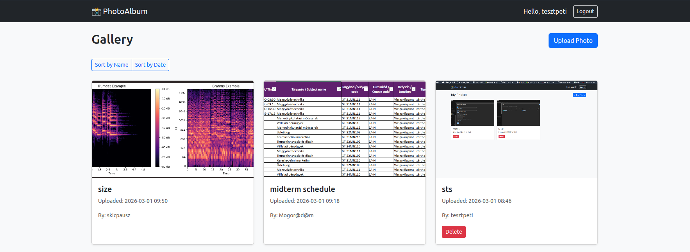

---

# Overview

PhotoAlbum is a Django web application deployed on OpenShift.

Users can:

- Register and log in
- Upload photos
- View uploaded photos
- Delete their own photos

The application uses:

- **PostgreSQL** for relational data
- **AWS S3 object storage** for uploaded images
- **OpenShift Deployments and Services** for orchestration

The system is designed to be **stateless and scalable**.

---

# Architecture

The system consists of:

- 1 Django application pod (`photoalbum-git`)
- 1 PostgreSQL pod (`postgres`)
- 1 Persistent Volume Claim (PVC) for PostgreSQL
- AWS S3 bucket for image storage
- 1 Service + 1 Route for external access

The Django application pod is completely **stateless**.

All persistent data is stored externally:

- Relational data → PostgreSQL PVC  
- Image files → AWS S3  

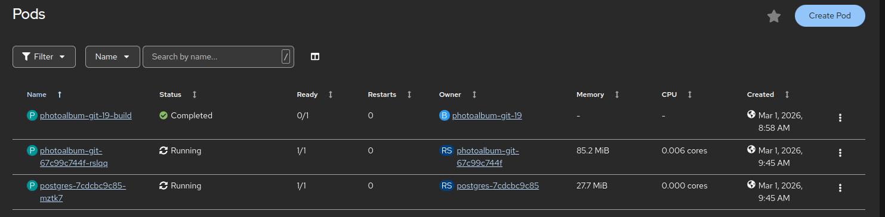

---

# Components

## 1. Django Application (`photoalbum-git`)

- Type: Deployment
- Port: 8080
- Replicas: 1 (scalable)
- Stateless

### Responsibilities

- Handles HTTP requests
- User authentication
- Image upload
- Stores metadata in PostgreSQL
- Uploads image files directly to AWS S3

### Storage

No Persistent Volume is mounted.

Uploaded images are stored in AWS S3: `photoalbum-skicpausz-media`

---

## 2. PostgreSQL Database (`postgres`)

- Type: Deployment
- Port: 5432
- Replicas: 1
- Stateful

### Responsibilities

- Stores users
- Stores image metadata
- Stores authentication data
- Stores Django migrations

### Persistent Storage

Mounted PVC: `postgres-data-pvc → /var/lib/pgsql/data`

If the PostgreSQL pod restarts, the database remains intact.

---

# Storage Design

## postgres-data-pvc

Used only by PostgreSQL.

Contains:

- Database tables
- WAL logs
- All relational data

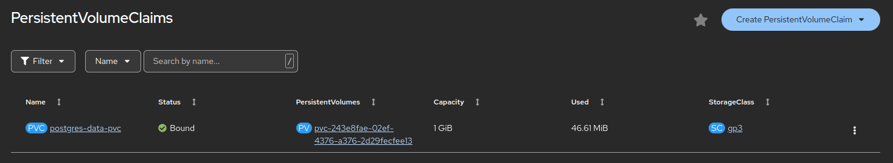

## AWS S3 Object Storage

Used only by the Django application.

Contains:

- Uploaded image files

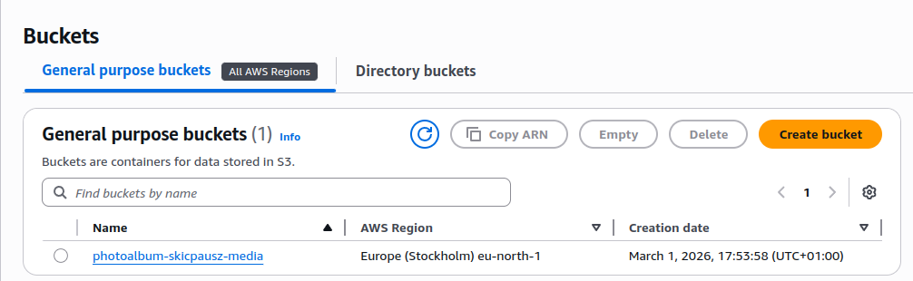

Accessed by OpenShift through the `photoalbum-django` **IAM user**.

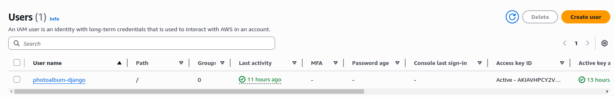
---
# Functionalities

The application staiesfies the minimal functional requirements:
- Photo upload/delete
- Photos have a name (max 40 characters) and an upload date
- Photos can be sorted by their name and the upload date
- When clicked on an item in the album its photo is displayed
- User handling: register, login, logout
- Upload and delete allowed only for authenticated users

Additional functionalities:
- The galery is displayed as a tile of images, where instead of the names of the entries, the user can see a preview of the image associated with that entry
- Photos can be only deleted by the user who uploaded them
- An admin user was created (me), who can delete any images

---
# Why S3 Instead of PVC for Media Files?

Initially, uploaded images were stored on a shared Persistent Volume (PVC), and under normal circumstances this setup worked as expected. However, during redeployments, an issue occurred intermittently — roughly 1 out of 5 times, the new pod failed to start while the old pod continued running.

After inspecting the **Events** tab of the newly created pod (which remained stuck in the *Creating* state), I discovered that the error was caused by the media PVC still being mounted to the old pod. The underlying problem was that the volume supported only **ReadWriteOnce (RWO)** access mode, meaning it could be attached to only one pod at a time.

Because the deployment strategy was set to **RollingUpdate**, Kubernetes attempted to start the new pod before terminating the old one. However, the new pod could not mount the PVC since it was still attached to the running old pod. At the same time, the old pod was not terminated because the RollingUpdate strategy ensures availability by keeping it alive until the new pod becomes ready. This resulted in a deadlock situation:

- The new pod could not start without the PVC.
- The PVC could not detach while the old pod was still running.
- The old pod would not terminate because the new pod never became ready.

The only way to resolve the situation manually was to delete the old pod, which would release the volume and allow the new pod to mount it successfully.

A simple solution would've been to switch the deployment strategy to **Recreate**, which termintes all running pods, before starting the new ones. But, as my future tasks include making my application **scalable**, this **RWO** PVC would prevent me from running multiple pods of my application. Thus, I decided to switch to an AWS S3 object storage as my media storage. 
## Why S3 Solves This Problem

Switching to S3 (object storage) eliminates this limitation entirely. Unlike PVCs with RWO access mode:

- S3 is not mounted as a block device.
- Multiple pods can access the same bucket simultaneously.
- There is no attachment/detachment lifecycle tied to individual pods.
- Rolling updates work seamlessly without storage-related conflicts.

By moving media files to S3, the deployment becomes more reliable, scalable, and resilient to rolling updates. It also improves decoupling between compute (pods) and storage, aligning better with cloud-native design principles.

---

# Persistence Verification (test for myself)

The system was tested by:

- Deleting the PostgreSQL pod
- Deleting the Django pod

After recreation:
- Database data remained (user info persisted thanks to the PVC)
- Uploaded images remained (media persisted thanks to the S3 object storage)

This confirmed correct persistent volume configuration.

---


# Auto-build based on git

This is mainly just for me, so if I have to do it again, i know how to.

According to the Red Hat tutorial: https://redhat-scholars.github.io/openshift-starter-guides/rhs-openshift-starter-guides/4.9/nationalparks-java-codechanges-github.html

1. Copy the webhook for github (with secret!)
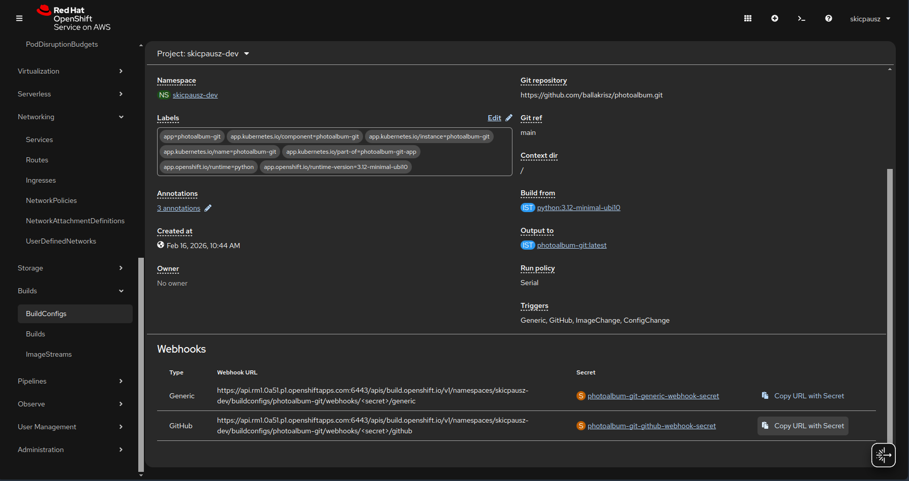

2. Paste it into github
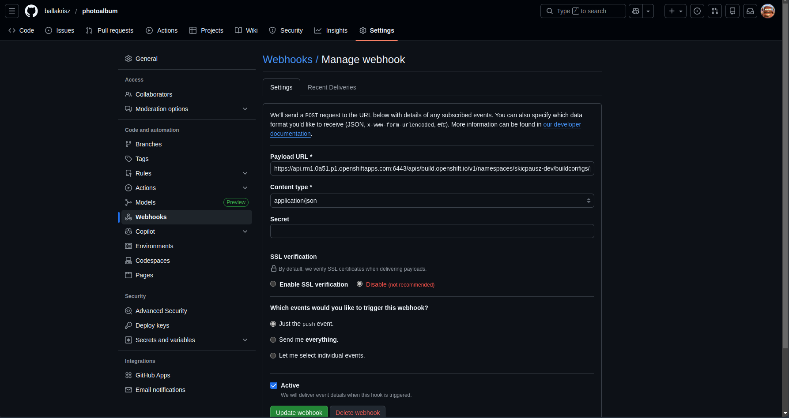


### Unfortunately it did not work.
I recieved the following response on github:
```bash
{"kind":"Status","apiVersion":"v1","metadata":{},"status":"Failure","message":"buildconfigs.build.openshift.io \"photoalbum-git\" is forbidden: User \"system:anonymous\" cannot create resource \"buildconfigs/webhooks\" in API group \"build.openshift.io\" in the namespace \"skicpausz-dev\"","reason":"Forbidden","details":{"name":"photoalbum-git","group":"build.openshift.io","kind":"buildconfigs"},"code":403}
```
According to a thread i found online (https://access.redhat.com/solutions/7105930):

"From OCP version 4.16 onward, all webhooks for BuildConfigs must either have an OpenShift authentication token in their HTTP headers, OR an administrator must grant the system:webhook role to the system:unauthenticated group in the namespace where the BuildConfig resides.
"

I had to add the webhook role to the unauthenticated group via the following command:
```bash
oc policy add-role-to-group system:webhook system:unauthenticated -n skicpausz-dev
```

### After this, the GitHub webhook response was 200 OK, but pushing still didn't initiate a build.

OpenShift defaults to the "master" branch of git, while I was using the "main" branch. To force OpenShift to use the "main" branch, i had to add the following code to my BuildConfig
```bash
source:
  type: Git
  git:
    uri: 'https://github.com/ballakrisz/photoalbum.git'
    ref: main
  contextDir: /
```
Also, I had to add this to the yaml config of my photoalbum project, to make sure the Deployment is watching the ImageStream and that every new build forces a new rollout of my pod (Though i tried like 10 things all at the same time, so this might not be necessary. I think the build automatically starts a new pod when finished by default):
```bash
metadata:
  annotations:
    image.openshift.io/triggers: '[{"from":{"kind":"ImageStreamTag","name":"photoalbum-git:latest"},"fieldPath":"spec.template.spec.containers[?(@.name==\"photoalbum-git\")].image"}]'
```

---

# Auto-scaling Configuration
To ensure the application can handle increasing load, **Horizontal Pod Autoscaling (HPA)** was configured in OpenShift.

The goal was to:
- Automatically **scale up** when CPU usage increases
- Automatically **scale down** when load decreases


## HPA Configuration

```yaml
apiVersion: autoscaling/v2
kind: HorizontalPodAutoscaler
metadata:
  name: photoalbum-hpa
spec:
  scaleTargetRef:
    apiVersion: apps/v1
    kind: Deployment
    name: photoalbum-git
  minReplicas: 1
  maxReplicas: 10
  metrics:
    - type: Resource
      resource:
        name: cpu
        target:
          type: Utilization
          averageUtilization: 60
  behavior:
    scaleUp:
      stabilizationWindowSeconds: 0
      selectPolicy: Max
      policies:
        - type: Percent
          value: 200
          periodSeconds: 5
    scaleDown:
      stabilizationWindowSeconds: 5
      selectPolicy: Max
      policies:
        - type: Percent
          value: 200
          periodSeconds: 5
```
Here, I defined a maximum of 10 replicas, where a new one is started when the average CPU utilization across the pods exceeds 60%. The autoscaler monitors the CPU usage and dynamically adjusts the number of replicas to maintain this target utilization.

The `scaleUp` behavior is configured to react immediately (`stabilizationWindowSeconds: 0`) and can increase the number of replicas by up to 200% every 5 seconds, allowing rapid scaling in response to sudden load spikes.

The `scaleDown` behavior uses a short stabilization window of 5 seconds to prevent rapid fluctuations (thrashing) and can reduce the number of replicas by up to 200% every 5 seconds when the load decreases.

Overall, this configuration ensures responsive scaling while still maintaining a small buffer against unstable scaling behavior.


## Deployment Configuration
```yaml
- resources:
    limits:
      cpu: '2'
      memory: 1Gi
    requests:
      cpu: 500m
      memory: 512Mi
  readinessProbe:
    httpGet:
      path: /
      port: 8080
      scheme: HTTP
    initialDelaySeconds: 5
    timeoutSeconds: 2
    periodSeconds: 5
    successThreshold: 1
    failureThreshold: 3
  terminationMessagePath: /dev/termination-log
  name: photoalbum-git
  livenessProbe:
    httpGet:
      path: /
      port: 8080
      scheme: HTTP
    initialDelaySeconds: 15
    timeoutSeconds: 1
    periodSeconds: 10
    successThreshold: 1
    failureThreshold: 3
  env:
    - name: APP_MODULE
      value: 'config.wsgi:application'
    - name: WEB_CONCURRENCY
      value: '4'
```
Here, I configured resource management, health checks, and runtime behavior for the deployment to ensure stability and efficient scaling.

The `resources` section defines guaranteed and maximum resource usage. Each pod requests 500 millicores of CPU and 512Mi of memory, while it can use up to 2 CPU cores and 1Gi of memory. **I had to set the request quite high, so the the app can handle the avalance of logins at the beginning of the stress test. This also applies to my postgres deployment as well**

```bash
oc set resources deployment/photoalbum-git \
  --requests=cpu=500m,memory=512Mi \
  --limits=cpu=2,memory=1Gi
```  
The `readinessProbe` checks whether the application is ready to serve traffic. It starts 5 seconds after container startup and runs every 5 seconds. If the probe fails 3 times, the pod is marked as not ready and removed from service endpoints. This helps avoid sending traffic to pods that are still initializing or temporarily unavailable.


```bash
oc set probe deployment/photoalbum-git \
  --readiness \
  --get-url=http://:8080/ \
  --initial-delay-seconds=5 \
  --period-seconds=5 \
  --timeout-seconds=2 \
  --failure-threshold=3 \
  --success-threshold=1
```

The `livenessProbe` ensures the application is still running correctly. It starts after 15 seconds and runs every 10 seconds. If it fails repeatedly, Kubernetes restarts the container. This provides automatic recovery from deadlocks or crashes.
```bash
oc set probe deployment/photoalbum-git \
  --liveness \
  --get-url=http://:8080/ \
  --initial-delay-seconds=15 \
  --period-seconds=10 \
  --timeout-seconds=1 \
  --failure-threshold=3 \
  --success-threshold=1
```
    

Environment variables configure the application runtime (**Gunicorn** + concurrency). Initially a django developer runtime was used, which was really slow.
```bash
oc set env deployment/photoalbum-git \
  APP_MODULE=config.wsgi:application \
  WEB_CONCURRENCY=4
```

To ensure even load distribution, I disabled sticky sessions in OpenShift:
```bash
oc annotate route photoalbum-git \
  haproxy.router.openshift.io/disable_cookies="true"
```

## Locust Load Testing Configuration

To evaluate the performance and scalability of the application, I implemented a custom load-testing setup using Locust. I deployed Locust as a separate pod inside the cluster, allowing it to generate realistic internal traffic.

The Locust script simulates real user behavior rather than simple HTTP requests. Each virtual user logs in with pre-created credentials, interacts with the application, and performs a mix of actions including browsing, sorting, uploading images, viewing details, and deleting photos.

Key aspects of the implementation:

* **Connection handling**:
  I explicitly disabled HTTP keep-alive to simulate independent client requests and avoid connection reuse:

  ```python
  self.client.headers.update({"Connection": "close"})
  ```

* **User simulation**:
  A pool of 50 pre-created users is cycled through to avoid registration overhead and ensure consistent authentication behavior:

  ```python
  USER_CREDENTIALS = [(f"locust_{i}", "Test12345!") for i in range(50)]
  user_pool = cycle(USER_CREDENTIALS)
  ```

* **Realistic behavior modeling**:
  Each user:

  * Logs in with CSRF handling
  * Views the photo list
  * Sorts content
  * Uploads dynamically generated images
  * Views photo details
  * Deletes their own photos

* **Dynamic image generation**:
  Instead of reusing static files, images are generated on the fly using Pillow:

  ```python
  img = Image.new("RGB", (64, 64), (...))
  ```

  This avoids I/O bottlenecks and better simulates real uploads.

* **Stateful interactions**:
  Each user tracks their own uploaded photo IDs, ensuring that operations like viewing and deletion behave realistically and do not interfere with other users.

### Locust Configuration Using ConfigMap

Instead of baking the `locustfile.py` into the Docker image, I used a ConfigMap to mount the test script directly into the Locust pod. This approach allows updating the load test logic without rebuilding or redeploying the image.

First, I created a ConfigMap from the local `locustfile.py`:

```bash
oc create configmap locustfile \
  --from-file=locustfile.py
```

Then, I mounted this ConfigMap into the Locust deployment:

```bash
oc set volume deployment/locust \
  --add \
  --name=locustfile-volume \
  --mount-path=/mnt/locust \
  --configmap-name=locustfile
```

This makes the `locustfile.py` available inside the container at:

```
/mnt/locust/locustfile.py
```


For dependencies (e.g., Pillow), I still use a lightweight custom image:

```dockerfile
FROM locustio/locust

USER root
RUN pip install pillow
USER locust
```

I used this setup, as it makes iterating the test script much easier, as i don't need to rebuild or redeploy my locust image, i just update my `ConfigMap` and restart my locust pod.

The `Dockerfile`, `locustfile.py`, and the user generator `start_setup.py` files can be found under the `locust` folder in the repo.

---
# Running Locust Stress Test

To run the load test, I used the Locust web interface while simultaneously observing application behavior and Kubernetes scaling in real time. The process is documented through a sequence of screenshots, where the timestamp on my local machine serves as a reference timeline.

## Before

The initial state of the S3 bucket and OpenShift pods was as follows:

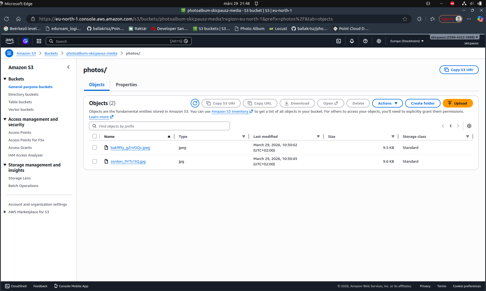
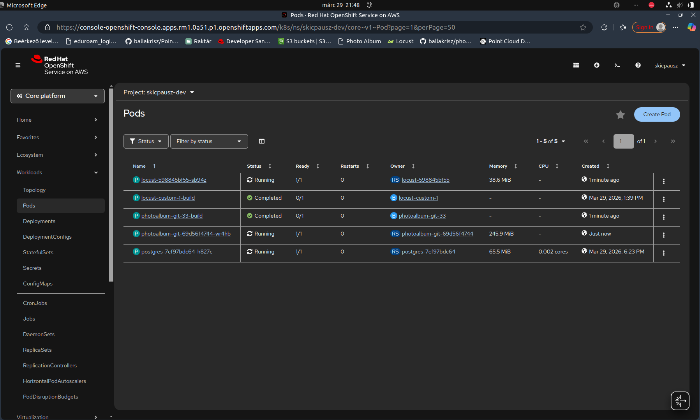

This was also reflected in the application, which initially contained only two photos:

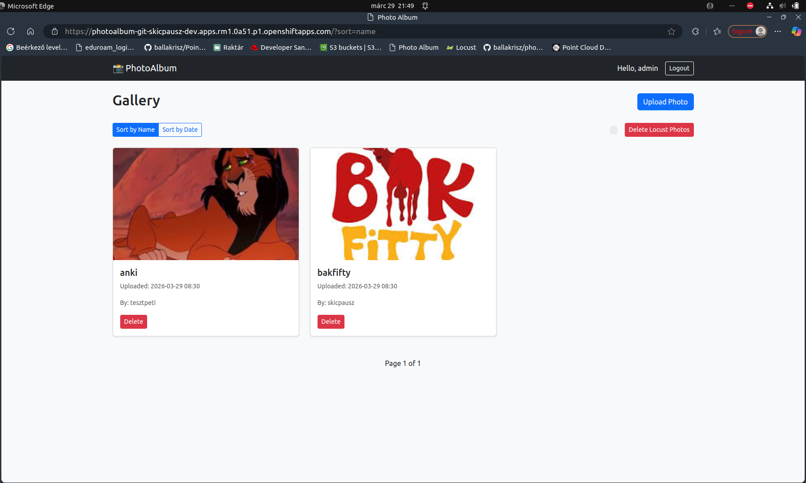

The Locust UI was exposed via an OpenShift route, enabling configuration directly from the browser. I configured the test to simulate 50 users with a spawn rate of 1 user per second.

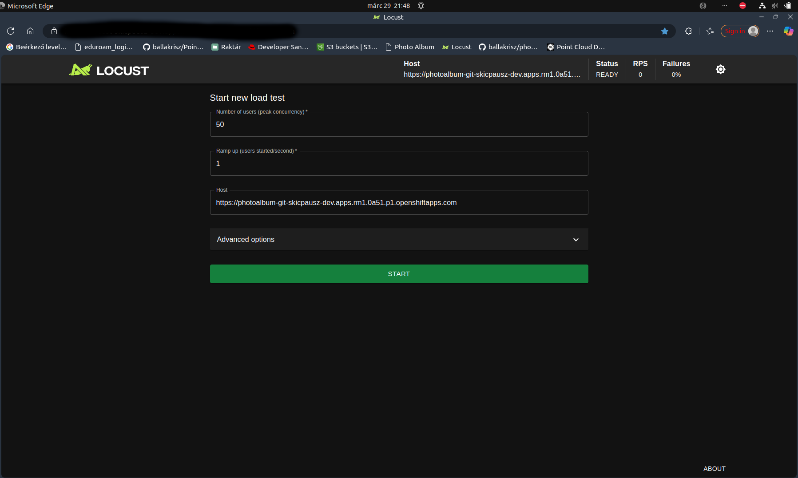

## During

During the test execution, all 50 users logged in successfully and generated approximately 65 requests per second:

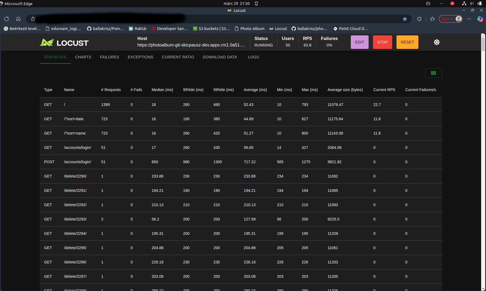

As a result of the increased load, the Horizontal Pod Autoscaler scaled the deployment up to 4 pods:

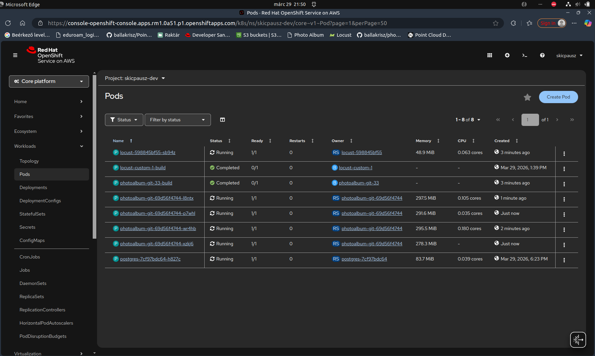

## After

After running Locust for about 2–3 minutes, I stopped the test. At this point, a large number of test ("dummy") images had been generated:

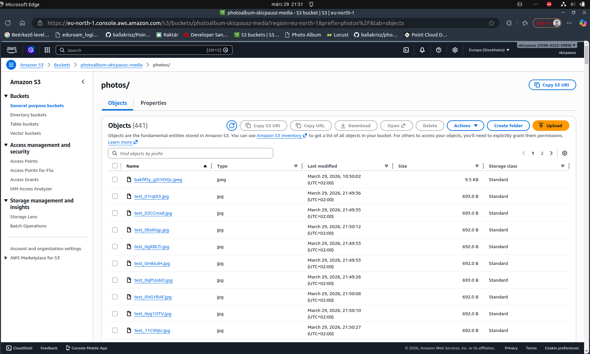
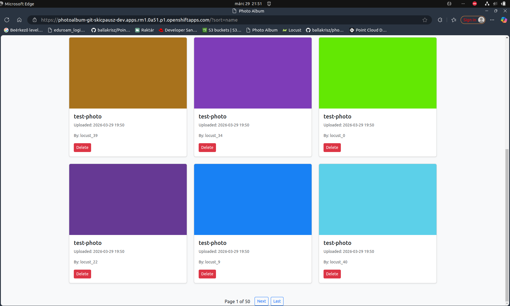

The Locust statistics show a gradual increase in both requests per second and response time during the ramp-up phase, primarily due to the cost of user login. Once all users were active, the request rate stabilized while response times decreased as the system adapted to the steady load.

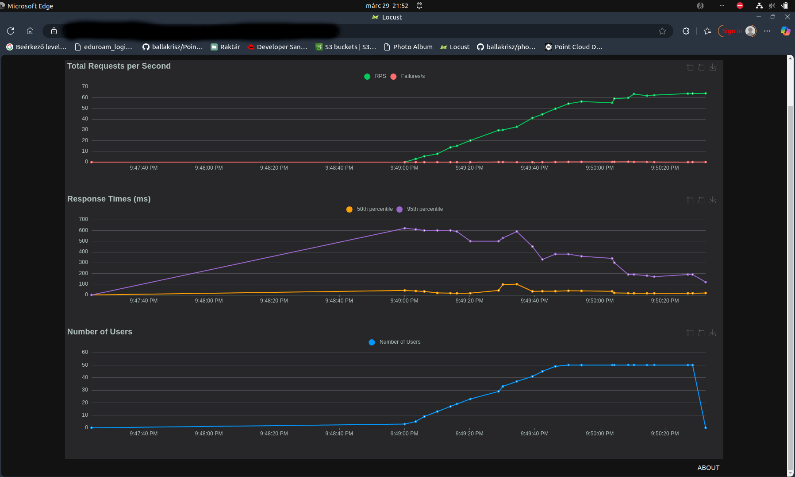

Only a small number of failures occurred, primarily due to users attempting to access images that had already been deleted. While this behavior will be improved in the future, it highlights the benefit of using Locust, as it exposes realistic race conditions that arise under concurrent usage.

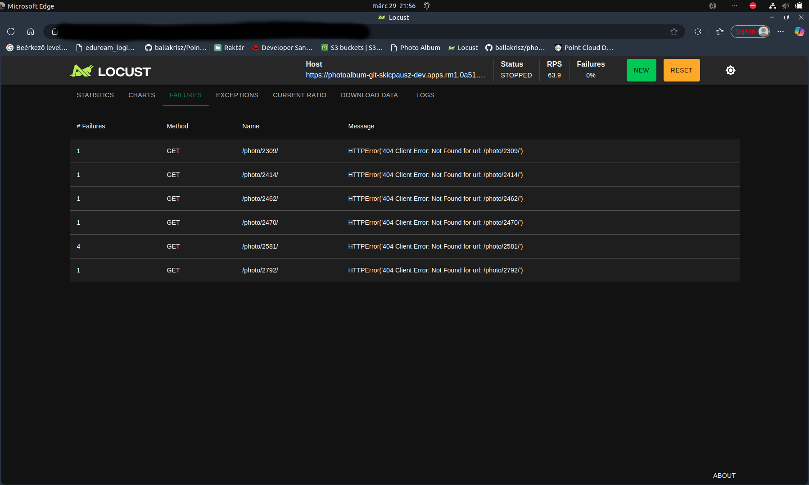

After the stress test was over, the system correctly scaled back down to a single pod, demonstrating that both scaling up and scaling down function as expected:

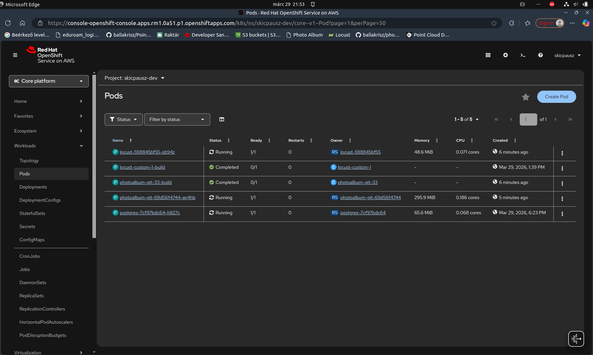

## Locust Cleanup

During an earlier test run, I unintentionally generated over 1000 dummy images. Since deleting them manually from both S3 and the database would be impractical, I implemented a dedicated cleanup feature.

I added a `Delete Locust Photos` button, visible only to the admin user. This functionality iterates through all Locust-generated users and removes their associated images from both S3 and the database.

Because this operation can involve hundreds of images and take a significant amount of time, I implemented it as an asynchronous task to avoid request timeouts.

# Lessons learned by using Locust stress test.

My application uses a card-based gallery view that displays a snippet of stored images, which are shown in actual size when clicked. While this provides a clean and visually appealing user experience, stress testing with Locust revealed significant performance issues, as shown below:

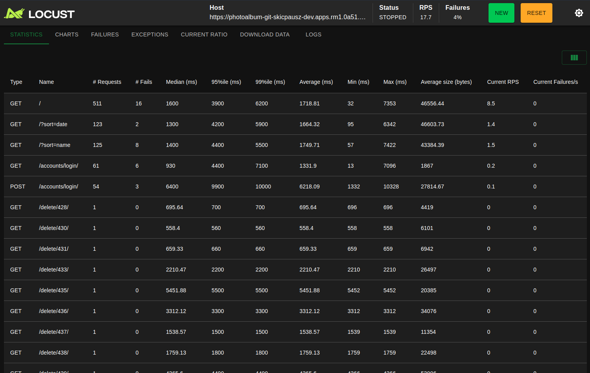
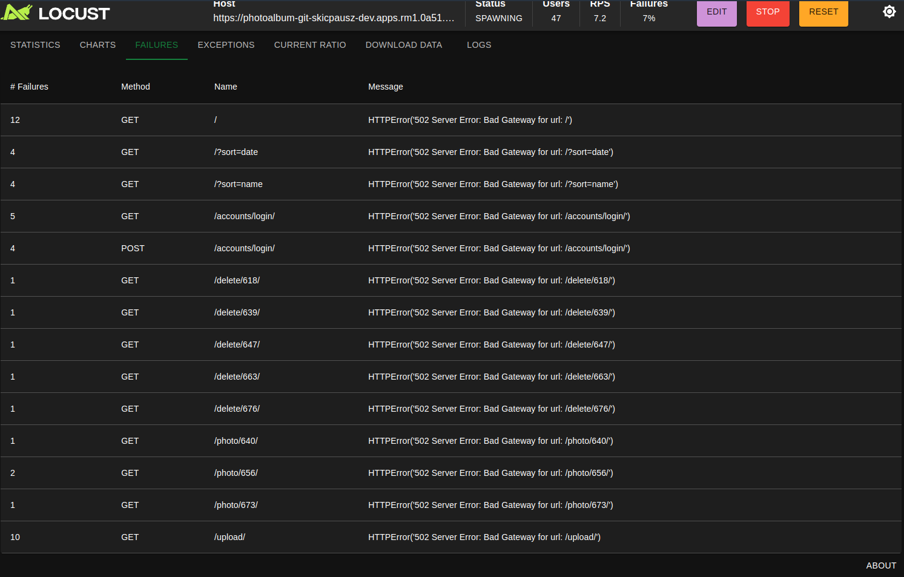

The response times were extremely high, and as more users accessed the system concurrently, timout failures began to appear. These failures were primarily caused by the backend attempting to load and return all images at once without any form of pagination or lazy loading. This resulted in excessive memory usage, increased database query times, and network congestion due to large payload sizes.

Additionally, the server struggled to handle the growing number of simultaneous requests, leading to timeouts and dropped connections. The lack of caching and inefficient image handling further amplified the issue, making the system unsuitable for scaling under real-world usage.

From this, I learned that even visually simple features like image galleries can become major bottlenecks if not designed with scalability in mind. To address these issues, I implemented pagination, caching, and other optimizations to significantly improve performance and stability under load.  

Here, we can see that the response times **drastically** decreaed (by a magnitude of 100), and also the timeout errors ceased.


# Infrastructure as Code (IaC)

To make the deployment reproducible and automated, I implemented an Infrastructure as Code setup using **Terraform**, **OpenShift manifests**, and **GitHub Actions**. The goal was to avoid manual configuration both in AWS and OpenShift, and instead manage everything from version-controlled files.

---

## Terraform

Terraform is responsible for provisioning and configuring external resources and integrating them with the cluster.

### What it manages

- **AWS S3 bucket**
  - Stores uploaded images

- **IAM user for the application**
  - `photoalbum-django`
  - Restricted access to the S3 bucket only

- **Access keys**
  - Generated automatically

- **Kubernetes Secret**
  - Created directly from Terraform
  - Injected into OpenShift
  - Contains AWS credentials and bucket name

This ensures that the application can access S3 without any manual secret creation.

### Terraform State Management

The Terraform state is stored remotely in S3.

This ensures:
- Persistent state tracking
- Safe re-application of infrastructure
- No local state issues

---

## OpenShift Manifests (`app.yaml`)

The application itself is also defined as code using Kubernetes/OpenShift YAML files.

This includes:

- Deployment (Django application)
- Service
- Route
- Environment variables
- Secret references

Instead of configuring these through the OpenShift web UI, everything is stored in `app.yaml`.

### What this enables

- The entire application can be recreated with a single command:

  ```bash
  oc apply -f app.yaml
  ```

- No manual configuration
- Version-controlled deployment changes

### Important detail

The deployment is tightly integrated with:

- **Terraform-generated secrets** (S3 credentials)
- **ImageStream builds** (new images trigger new pods)

This means the application, infrastructure, and secrets are all connected through code.

---

## GitHub Actions (CI/CD)

To automate everything, I created three separate workflows.

---

### 1. Terraform Workflow

Triggered on changes in the `terraform/` folder

- Runs `terraform apply`
- Updates infrastructure
- Refreshes Kubernetes secrets

---

### 2. Deploy Workflow

Triggered on changes in deployment YAML files in the `k8s/` folder

- Applies `app.yaml`
- Updates the running application

---

### 3. Build Workflow

Initially, a webhook was configured between OpenShift and GitHub that automatically triggered a build on every new commit. While this ensured continuous integration, it proved to be too coarse-grained for the project’s needs.

The webhook mechanism did not distinguish between different types of changes. As a result, builds were triggered even when modifications were unrelated to the actual application runtime, such as:
- Changes to Terraform configuration files
- Updates to `app.yaml`
- Edits to documentation (e.g., `README.md`)

This caused several issues:
- **Unnecessary builds:** Images were rebuilt when nothing important changed.
- **Wasted resources:** Time and compute power were used without benefit.

Because of this, the webhook-based approach was not suitable anymore, therefore a github Action is now responsible to trigger rebuild when onl when the actual application code changes

---


## Why IaC Was Important

Without IaC, the following had to be done manually:

- Creating AWS resources
- Managing credentials
- Creating OpenShift deployments
- Updating configurations

This was slow and error-prone. Which I experimented first hand, when my initial 30 day free trial ended on Developer Sandbox and I had recofngiure the entire application and infrastructure manually, which was painful to say the least..

With IaC:

- Infrastructure + application are both defined in code
- Deployment is fully reproducible
- No manual UI configuration is required
- Changes are traceable through Git

---

## Summary

The IaC setup ensures that:

- Cloud resources are provisioned automatically (Terraform)
- Application deployment is defined declaratively (`app.yaml`)
- Secrets are synchronized between AWS and OpenShift
- CI/CD pipelines handle build and deployment
