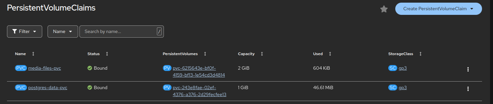

# PhotoAlbum – OpenShift Deployment

Created by: Balla Krisztián (RZWVC0)

The application is available at:
https://photoalbum-git-skicpausz-dev.apps.rm1.0a51.p1.openshiftapps.com/

(If you cannot reach the application, please send me a message on Teams. The Developer Sandbox sometimes automatically stops pods that have not been used for a while. Just message me on Teams and i'll restart the pods, so you can try the application yourself.)

## Overview

PhotoAlbum is a Django web application deployed on OpenShift.

Users can:
- Register and log in
- Upload photos
- View uploaded photos

The application uses PostgreSQL for structured data and Persistent Volumes to ensure data survives pod restarts.

---

# Architecture

The system consists of:

- 1 Django application pod (`photoalbum-git`)
- 1 PostgreSQL pod (`postgres`)
- 2 Persistent Volume Claims (PVCs)
- 1 Service + 1 Route for external access

The application pod is stateless.
All important data is stored in persistent volumes.

---

# Components

## 1. Django Application (photoalbum-git)

- Type: Deployment
- Port: 8080
- Replicas: 1

### Responsibilities
- Handles HTTP requests
- Authentication
- Image upload
- Reads/writes data to PostgreSQL

### Persistent Storage
Mounted PVC: media-files-pvc → /opt/app-root/src/media

This stores uploaded image files.

If the pod restarts, images remain because they are stored in the PVC.

---

## 2. PostgreSQL Database (postgres)

- Type: Deployment
- Port: 5432
- Replicas: 1

### Responsibilities
- Stores users
- Stores image metadata
- Stores authentication data
- Stores Django migrations

### Persistent Storage
Mounted PVC: postgres-data-pvc → /var/lib/pgsql/data

This contains the full PostgreSQL data directory.

If the pod restarts, the database remains intact.

---

# Storage Design

Two separate PVCs are used:

### postgres-data-pvc
Used only by PostgreSQL.

Contains:
- Database tables
- WAL logs
- All relational data

### media-files-pvc
Used only by Django.

Contains:
- Uploaded image files

---

# Persistence Verification (test for myself)

The system was tested by:

- Deleting the PostgreSQL pod
- Deleting the Django pod

After recreation:
- Database data remained (user info persisted)
- Uploaded images remained (media persisted)

This confirmed correct persistent volume configuration.

---

# Functionalities

The application staiesfies the minimal functional requirements:
- Photo upload/delete
- Photos have a name (max 40 characters) and an upload date
- Photos can be sorted by their name and the upload date
- When clicked on an item in the album its photo is displayed
- User handling: register, login, logout
- Upload and delete allowed only for authenticated users

Additional functionalities:
- The galery is displayed as a tile of images, where instead of the names of the entries, the user can see a preview of the image associated with that entry
- Photos can be only deleted by the user who uploaded them
- An admin user was created (me), who can delete any images.